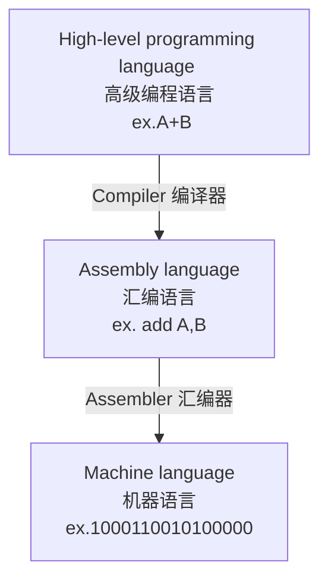

# Chapter 1:Computer abstractions and Technology

## Introduction

### 	计算机发展历史（略）

### 	Turing-complete（图灵完备/图灵完全）：一种计算模型能够模拟任何其他计算模型的能力

### 	Von Neumann Architecture（冯·诺伊曼结构）：

​	组成部分：

​		Arithmetic/Logic Unit（运算器）、Control Unit（控制器）、Memory Unit（存储器）、Input Device（输入设备）、Output Device（输出设备）五大部分。<u>通常也将最后两部分统称为I/O Device（输入输出设备）。</u>

​	特点：

​		Computation and memory are seperated（计算与存储分离）

​		Memory that stores data and instructions（数据与指令保存在同一个存储器）

​		Input and output mechanisms（输入与输出机制）

​		Instruction set architecture（ISA 指令集架构）

### Analog Computing（模拟计算机）：

​		与数字计算机运用数字电路处理**离散的数字信号**不同，模拟计算机使用电子器件或机械、液压等物理量，来处理**连续的模拟信号**，以模拟实际物理过程或事件。

Digital computing（数字计算机） | Analogcomputing（模拟计算机）
:-:|:-:
Accurate when encoded in many bits（以多位编码时较准确）| Less precision affected by noise （易受到模拟噪声的影响而导致不准确）
Scalable（可扩展的，因其本身依赖于数以亿计的晶体管组成的半导体电路） | Diffucult to integrate（难以集成，因为模拟噪声和错误会在级联电路中累积）
General Purpose（通用性） | Application-specific（特定应用）
Computational heavy（计算密集型） | Fast by nature（在模拟相关物理变化等响应较快）
Compute-only（专注于计算任务） | Sensors and actuators are mostly analog（传感器和执行器大多数是模拟的）

*模拟计算在AI领域的复兴能够帮助其克服冯·诺伊曼瓶颈*

### What is a computer?

​		1.Electronic realization 电子化的实现方式

​		2.A set of instructions in a well-defined manner 有指令集

​		3.Execution of a pre-recorded list of instructions 可执行指令

​		4.Memory that can store instructions and data 可存储指令和数据

​		5.Turing-complete in theory 计算能力上是图灵完全（等效于图灵机）

## Computer organization

​		

### From a High-Level Language to the Language of HardWare

## How to build processors?

### Transistor 晶体管：

​			P型半导体（电子密度小于正常水平）、N型半导体（电子密度大）

### Chips 芯片：

​	Wafer （晶圆）：制作半导体时所使用的硅晶片，如下图所示

​	Die （晶粒）：芯片未封装前的晶粒，其上已有芯片的所有功能电路。

​	Chip （芯片）：一种将电路小型化的方式，通常制造在半导体晶圆上

​	Yield （晶圆良率）：完成所有工艺步骤后测试合格的芯片的数量与整片晶圆上的有效芯片的比值 。

$$
\Large \rm{Dies \ per \ wafer \approx \frac{Wafer \ area}{Die \ area}  \tag{1}}
$$

$$
\Large \rm{Yield = \frac{1}{(1+\frac{Defects \ per \ area \times Die \ area}{2})^2} \tag{2}}
$$

$$
\Large \rm{Cost \ per \ die =\frac{Cost \ per \ wafer}{Dies \ per \ wafer \times Yield} \tag{3}}
$$

​	公式（1）为估算所得，公式（2）基于对集成电路工厂产量的经验观察，而指数与关键处理步骤的数量有关，公式（3）为直接推导可得。

##### 	公式的影响因素：

​		晶圆成本和面积都是固定的；

​		缺陷率（defect rate）由制造工艺决定；

​		芯片面积由架构和电路设计决定。

## Computer design: performance and idea

### Response Time/execution time and Throughput:

​	response time/execution time（响应时间/执行时间）：完成某项任务的时间

​	throughput/bandwidth（吞吐率/带宽）：单位时间内的工作完成量（e.g. tasks/transactions ... per hour）

### Relative Performance

$$
\Large \rm{performance（性能）= \frac{1}{execution \ time}}
$$

​	We know that X is ${\it {n}}$ times as fast as Y if
$$
\Large \rm{\frac{performance_X}{performance_Y} = \frac{execution \ time_Y}{execution \ time_X} =} \ \it n
$$

### Measuring Execution Time

#### 	elapsed time（实际运行时间）：determines system performance（真正决定系统性能）

$$
{\rm {elapsed \ time \ = \ I/O \ time \(输入输出所占时间) \+ \ processing \ time \ + \ OS \ overhead \ （系统开销） \ + \ idle \ time \ （空闲时间）} }
$$

#### CPU time（CPU时间）：time spent processing a given job（忽视I/O时间和其他时间）

​	分为 **user CPU time**（CPU花费在执行用户进程的时间，如执行应用程序代码）和 **system CPU time**（CPU花费在执行系统操作任务上的时间）

#### clock period（时钟周期）：duration of a clock cycle（完成一个时钟周期的时间）

#### clock frequency/clock rate（时钟频率）：cycles per second（每秒钟的时钟周期数）
$$
\Large {\rm {clock \ frequency \ = \ \frac{1}{clock \ period}}}
$$
#### CPU Time：

$$
\large {\rm {CPU \ Time \ = \ CPU \ Clock \ Cycles \ （时钟周期数）\times \ Clock \ Cycle \ Time \ = \ \frac{CPU \ Clock \ Cycles}{Clock \ Rate}}}
$$

​	改善CPU Time的方法：

​		Reducing number of clock cycles（减少时钟周期数）

​		Increasing clock rate（提高时钟频率）

​		often trade of  clock rate against cycle count（硬件设计师经常需要在时钟速率和时钟周期数之间进行权衡取舍）

### Instruction Count and CPI（Cycles per Instruction 执行一个指令所占时钟周期数）

$$
\Large {\rm {Clock \ Cycles \ = \ Instruction \ Count \ \times \ Cycles \ per \ Instruction \  (CPI)}}
$$

$$
\large {\rm {CPU \ Time \ = \ Instruction \ Count \ \times \CPI \ \times \ Clock \ Cycle \ Time \ = \ \frac{Instruction \ Count \ \times \ CPI}{Clock \ Rate}}}
$$

​	Instructionn Count for a program is determined by **Program,ISA(指令集) and compiler**

​	Average CPI is determined by **CPU hardware** 

​	当不同的指令类分别有各自的时钟周期数时：

$$
\Large {\rm {Clock \ Cycles \ = \ \sum_{i=1}^{n}{(CPI_{i} \ \times \ Instruction \ Count_i)}}}
$$

$$
\Large {\rm {CPI \ = \ \frac{Clock \ Cycles}{Instruction \ Count} \ = \ \sum_{i=1}^{n}{(CPI_i \ \times \ \frac{Instruction \ Count_i}{Instruction \ Count})}}}
$$

### Summary

$$
\Large {\rm {CPU \ Time \ = \ \frac{Instructions}{Program} \ \times \ \frac{Clock \ Cycles}{Instruction} \ \times \ \frac{Seconds}{Clock \ cycle}}}
$$

$$
\Large {\rm {CPU \ Time \ = \ 每个程序包含指令数 \ \times \ 每条指令的时钟周期数 \ \times \ 每个时钟周期是多长时间}}
$$

​	影响因素：

​		算法：影响IC（指令数），有可能影响CPI

​		编程语言：影响IC、CPI

​		编译器：影响IC、CPI

​		指令集架构：影响IC、CPI、$T_c$ （每个时钟周期的时间）

## Power 

$$
\Large {\rm {Power（功率） \ = \ Capacitive \ load \ （电容负载） \ \times \ Voltage^2 \ \times \ Frequency}}
$$

​		power wall（功率壁垒）：不能更好地降低功率、不能更好地散热

## Amdahl's Law（阿姆达尔定律）

$$
\Large {\rm {T_{imporved} \ = \ \frac{T_{affected}}{improvement \ factor} \ + \ T_{unaffected}}}
$$

​	系统优化后的时间为未优化部分的时间和优化部分后的时间和

## MIPS:Millions of Instructions Per Second（每秒所跑百万指令数）

## Eight Great Ideas:

### 	Design for Moore's Law（设计紧跟摩尔定律）

### 	Use Abstraction to Simplify Design（采用抽象简化设计）

### 	Make the Common Case Fast（加速大概率事件（阿姆达尔定律））

### 	Performance via Parallelism（通过并行提高性能）

### 	Performance via Pipelining（通过流水线提高性能）

### 	Performance via Prediction（通过预测提高性能）

### 	Hierarchy of Memories（存储器层次）

### 	Dependability via Redundancy（通过冗余提高可靠性）